<p align="center">
  
</p>

<h1 align="center">OptOut</h1>

<p align="center"><em>shop like normal. skip the bill.</em></p>

<p align="center">
  <strong>A Chrome extension that lets you click "Buy Now" without buying. You get the order confirmation; your card doesn't get charged.</strong>
</p>

<p align="center">
  
  
  
  
  
</p>

<p align="center">
  <a href="#-see-it">See it</a> ·
  <a href="#-why-this-exists">Why this exists</a> ·
  <a href="#-quick-start">Quick Start</a> ·
  <a href="#-how-it-works">How it works</a> ·
  <a href="#-where-it-works">Where it works</a> ·
  <a href="#-privacy">Privacy</a> ·
  <a href="#-limitations">Limitations</a> ·
  <a href="#-development">Development</a>
</p>

---

OptOut sits quietly in your browser while you shop. Browse, compare, fill your cart, and click **Place order** the way you always do. While OptOut is on, that last click shows an order confirmation instead of placing the order, and adds the price to a running total of money you didn't spend. When you actually want something, flip the switch off and buy it.

It works on **Amazon** and on stores that use **Shopify** checkout. Everything happens inside your browser: there's no server, no account, and no data sent anywhere.

## 🛡 See it

| Without OptOut | With OptOut |
|---|---|
| You click **Place order**. The order goes through. A few days later a box arrives. | You click **Place order**. You see **Order confirmed** and how much you kept. Nothing is sent to the store; nothing is charged. |

| 1. Buy buttons are labeled | 2. Clicking one "places" the order | 3. The savings add up |
|---|---|---|
| 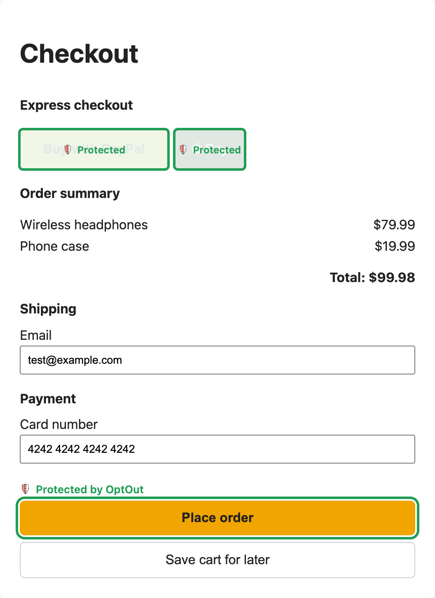 | 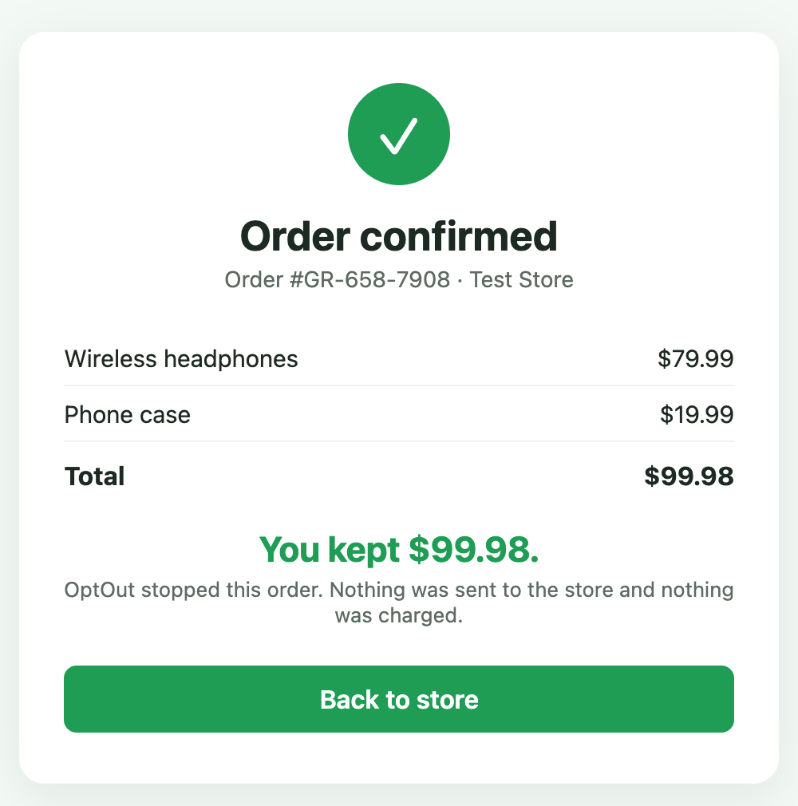 | 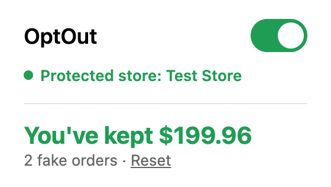 |

On real stores:

| Amazon | Shopify |
|---|---|
| 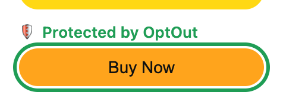 | 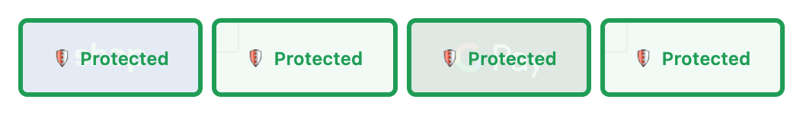 |
| 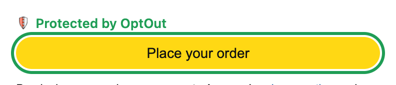 | 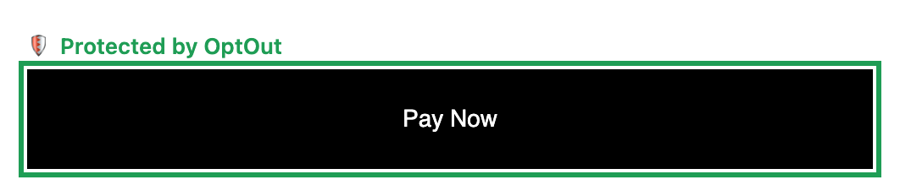 |

## 🌍 Why this exists

I noticed that a lot of the packages arriving at my door were things I didn't remember ordering, or didn't really want by the time they arrived. The gap between the satisfying click of "Buy Now" and the box showing up days later is where I was spending money I didn't mean to spend.

Online stores put a great deal of research and testing into making buying quick and frictionless. Relying on willpower alone to push back against that didn't work well for me. So instead of trying to change my habits, I changed the interaction: keep the part of shopping I enjoy, and make the final step optional.

OptOut isn't meant to stop you from shopping. It's a switch: on when you want a guardrail, off when you mean to buy. The point is to give that choice back to the person doing the shopping.

It's the first of a set of small tools built on one idea: **technology should serve the people who use it.** Next ideas include separating ads from content in social feeds, and adding friction to endless short-video feeds.

## ⚡ Quick Start

OptOut isn't on the Chrome Web Store yet. You'll need [Node.js](https://nodejs.org/) 20.19 or newer.

```sh
git clone https://github.com/lisacainyc/checkout-guardrail.git
cd checkout-guardrail
npm install
npm run build
```

Then load it into Chrome:

1. Open `chrome://extensions` and turn on **Developer mode** (top right).
2. Click **Load unpacked** and choose the `dist` folder.
3. A welcome page opens. Follow it to pin OptOut to your toolbar.

That's it. OptOut starts out **on**.

## 🧭 How it works

**The switch.** Click the OptOut icon to turn it on or off. The icon is a green shield while on and a red shield while off, with an ON/OFF badge so you don't have to rely on color.

<p>
  
  &nbsp;
  
</p>

**The labels.** On a supported checkout, every buy button gets a green **"Protected by OptOut"** label. Express-pay buttons (Shop Pay, PayPal, Google Pay, Venmo) get a **"Protected"** cover. **Add to Cart keeps working**: only buttons that place an order are blocked.

**The confirmation.** Click a protected button and you get an order confirmation with your items, the total, and how much you kept. **Back to store** returns you to the checkout with your cart untouched.

**The total.** The popup keeps a running total of everything you didn't buy. You can reset it to $0 at any time; OptOut asks you to confirm first.

| Switched off | Resetting the total |
|---|---|
| 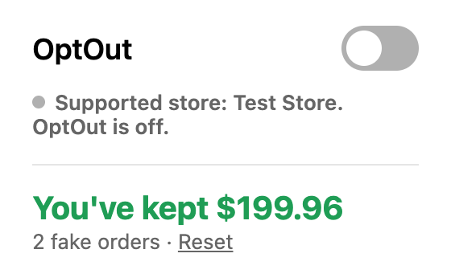 | 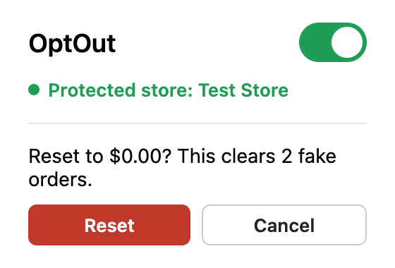 |

## 🏪 Where it works

| Store | Pages | Buttons blocked |
|---|---|---|
| **Amazon** (amazon.com, US site only) | Product pages, checkout | Buy Now, Subscribe & Save, Place your order |
| **Shopify** checkouts | Guest checkout, Shop Pay checkout | Pay now, Shop Pay, PayPal, Google Pay, Venmo |

Shopify support has been checked on Gymshark's checkout. Other Shopify stores use the same checkout system and should work too, but stores can customize their checkouts.

### When you're not protected

OptOut tells you when it can't help, instead of quietly looking protected:

- **Other stores' checkouts** get a red banner saying orders there are real.
- **If a supported store changes its page** and OptOut can't find the buy buttons, a red banner says so.

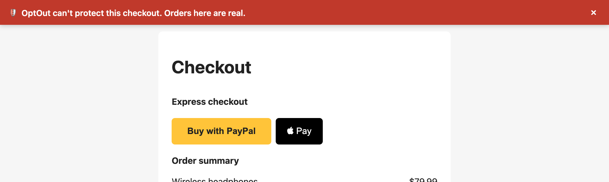

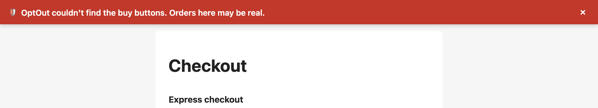

**Rule of thumb: if a buy button doesn't have a green "Protected" label, assume the order is real.**

## 🔒 Privacy

- **OptOut never reads what you type.** No card numbers, no addresses, nothing you enter in a form. It only reads the visible item names, prices and order total, to show on the confirmation screen.
- **Nothing leaves your browser.** Your switch setting and stopped orders are stored only on your computer (`chrome.storage.local`). No server, account, analytics or tracking.

| Permission | Why |
|---|---|
| **Read and change your data on all websites** | Chrome's wording for scripts that run on every site. OptOut needs it to block buy buttons on supported stores, which can be on any address (each Shopify store has its own), and to spot other stores' checkouts so it can warn you. On a page it only looks at the address, buy buttons, item names, prices and order total. |
| **Storage** | Saves your switch setting, stopped orders and saved total, on your computer only. |
| **Active tab** | When you click the OptOut icon, checks the current page's address to tell you whether the store is protected. |

## 🚧 Limitations

- **Only Amazon and Shopify checkouts are blocked.** Everything else gets the warning banner, not protection.
- **Stores change their pages.** When they do, OptOut may stop finding a button. The missing-button warning and the rule of thumb are there for that.
- **Button-level blocking.** OptOut stops clicks, form submits and the Enter key on buy buttons. A store's own code could still submit an order in a way that skips all of these. I haven't seen this on the supported stores (live tests on Amazon and Gymshark were blocked), but it can't be ruled out.
- **Amazon prices on the confirmation are per item.** Quantities aren't shown, but the total comes from Amazon's own "Order total".
- **For Subscribe & Save,** "You kept" uses the one-time price, which can be a little higher than the subscription price.
- **Chrome on desktop only.** Shopping apps on your phone aren't covered.

## 🛠 Development

Built with React, TypeScript and Vite, using [CRXJS](https://crxjs.dev/vite-plugin) to package it as a Manifest V3 Chrome extension.

| Command | What it does |
|---|---|
| `npm run build` | Builds the extension into `dist/`. After rebuilding, reload OptOut in `chrome://extensions` and refresh open store tabs. |

| Path | What's in it |
|---|---|
| `src/sites.ts` | **Supported stores.** Each store has its addresses and page types (checkout, product page), each with the buttons to block and where to read items and the total. Adding a store means adding an entry here. |
| `src/content.ts` | Runs on every page. On supported stores, labels and blocks buy buttons and shows the confirmation. |
| `src/warning.ts` | The "can't protect this checkout" banner for other stores. |
| `src/confirmation.ts` | The fake "Order confirmed" screen. |
| `src/order.ts` | Reads items and the total from the page (never form fields). |
| `src/storage.ts` | Switch state, stopped orders and the saved total. |
| `src/background.ts` | Keeps the toolbar icon and badge in sync with the switch. |
| `src/App.tsx` | The popup. |
| `welcome.html` | The page shown on first install. |
